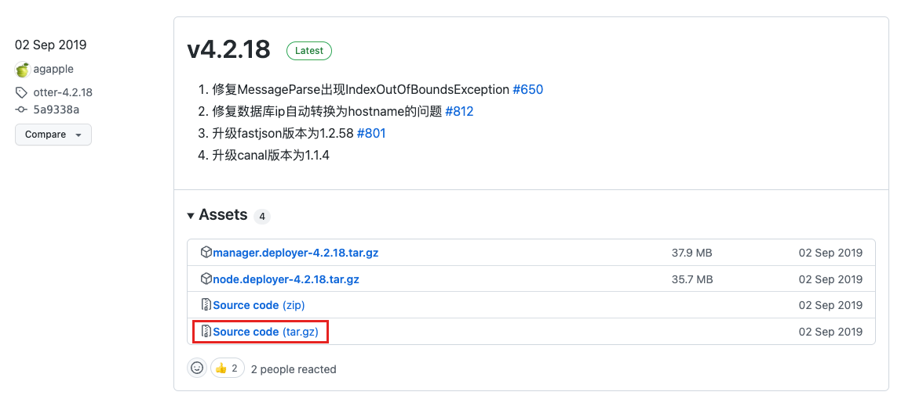
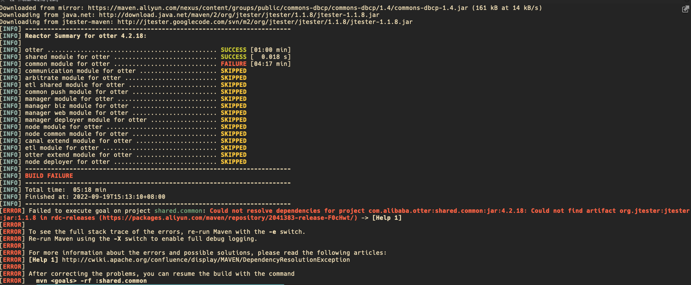
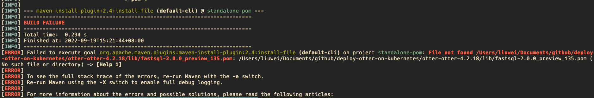
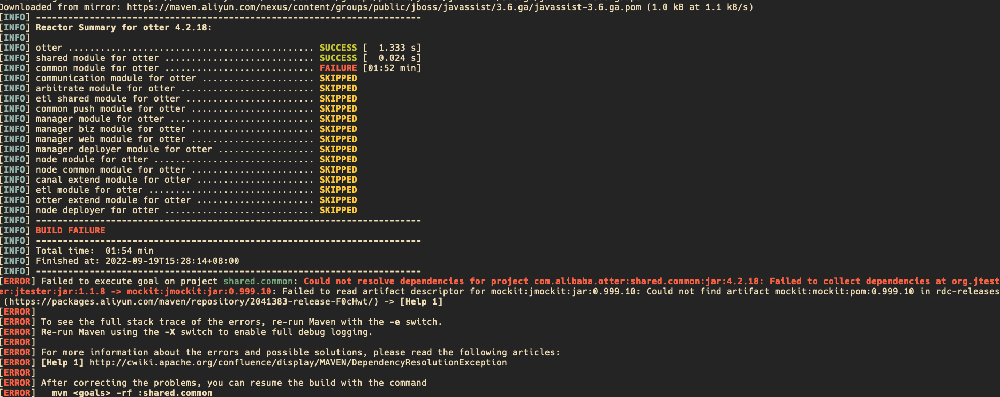
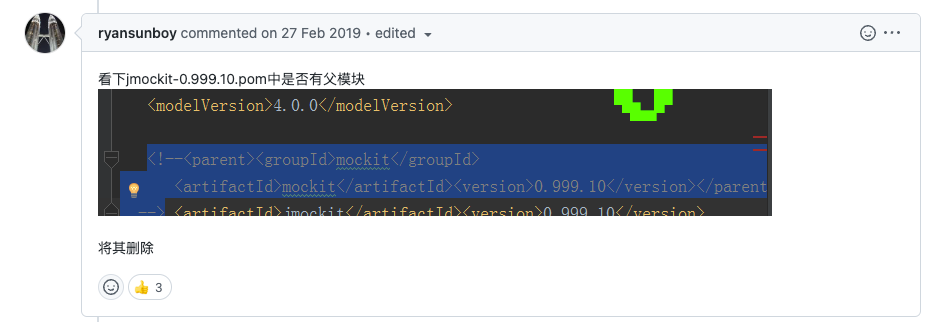
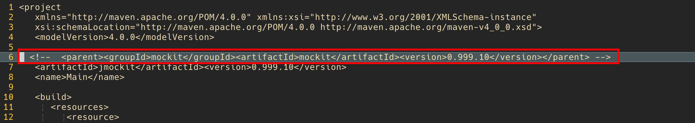
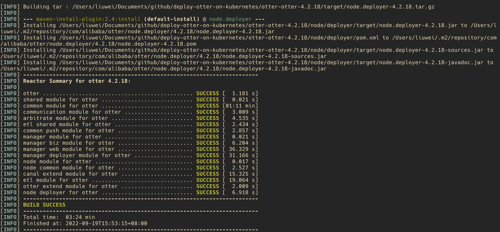
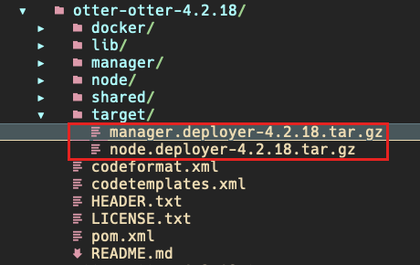
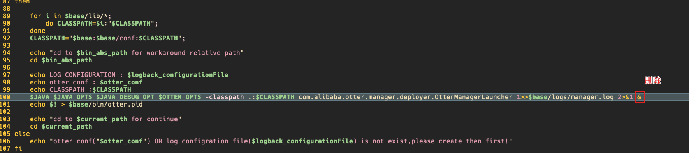
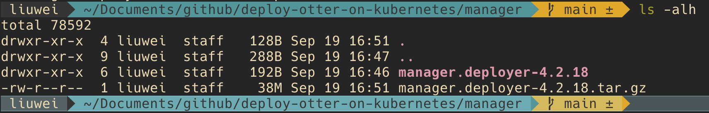

# k8s 部署 Otter

‼️otter已在阿里云推出商业化版本，开源版本估计不维护了。因此建议采用源码编译的方式，bug太多了，后期需要自己修复。

## 1、基于源码编译打包

### 1.1、 下载源文件

https://github.com/alibaba/otter/releases



### 1.2、 Maven 编译打包

```shell
tar zxvf otter-otter-4.2.18.tar.gz
cd otter-otter-4.2.18
mvn clean install -Dmaven.test.skip -Denv=release
```

编译报错如下：

```
[ERROR] Failed to execute goal on project shared.common: Could not resolve dependencies for project com.alibaba.otter:shared.common:jar:4.2.18: Could not find artifact org.jtester:jtester:jar:1.1.8 in rdc-releases (https://packages.aliyun.com/maven/repository/2041383-release-F0cHwt/) -> [Help 1]
```




解决方案参考：https://github.com/alibaba/otter/issues/2901


执行lib目录下的install.sh 文件；

```
cd lib
sh install.sh
```

报错如下：

```
[ERROR] Failed to execute goal org.apache.maven.plugins:maven-install-plugin:2.4:install-file (default-cli) on project standalone-pom: File not found /Users/liuwei/Documents/github/deploy-otter-on-kubernetes/otter-otter-4.2.18/lib/fastsql-2.0.0_preview_135.pom: /Users/liuwei/Documents/github/deploy-otter-on-kubernetes/otter-otter-4.2.18/lib/fastsql-2.0.0_preview_135.pom (No such file or directory) -> [Help 1]
```



解决方案参考：https://github.com/alibaba/otter/issues/824


那就先不去管它！

继续执行编译：

```
mvn clean install -Dmaven.test.skip -Denv=release
```

继续得到报错信息如下：

```
[ERROR] Failed to execute goal on project shared.common: Could not resolve dependencies for project com.alibaba.otter:shared.common:jar:4.2.18: Failed to collect dependencies at org.jtester:jtester:jar:1.1.8 -> mockit:jmockit:jar:0.999.10: Failed to read artifact descriptor for mockit:jmockit:jar:0.999.10: Could not find artifact mockit:mockit:pom:0.999.10 in rdc-releases (https://packages.aliyun.com/maven/repository/2041383-release-F0cHwt/) -> [Help 1]
```



解决方案参考：https://github.com/alibaba/otter/issues/290



```
vim lib/jmockit-0.999.10.pom
```

注释掉如下行：



再次编译，终于成功了：





编译完成后，会在根目录下产生target/manager.deployer-4.2.18.tar.gz 和 target/manager.deployer-4.2.18.tar.gz




## 2、manager 部署

### 2.1 创建**manager.deployer-4.2.18/manager**目录并解压manager.deployer-4.2.18.tar.gz到该目录

```
mkdir -p manager/manager.deployer-4.2.18
tar zxvf otter-otter-4.2.18/target/manager.deployer-4.2.18.tar.gz -C manager/manager.deployer-4.2.18
```

### 2.2 让启动脚本作为前台进程保持运行

```
cd manager
vim manager.deployer-4.2.18/bin/startup.sh
```

删除启动命令最后一个 **&** 符号；



### 2.3 打包

```
tar czvf manager.deployer-4.2.18.tar.gz manager.deployer-4.2.18
```




